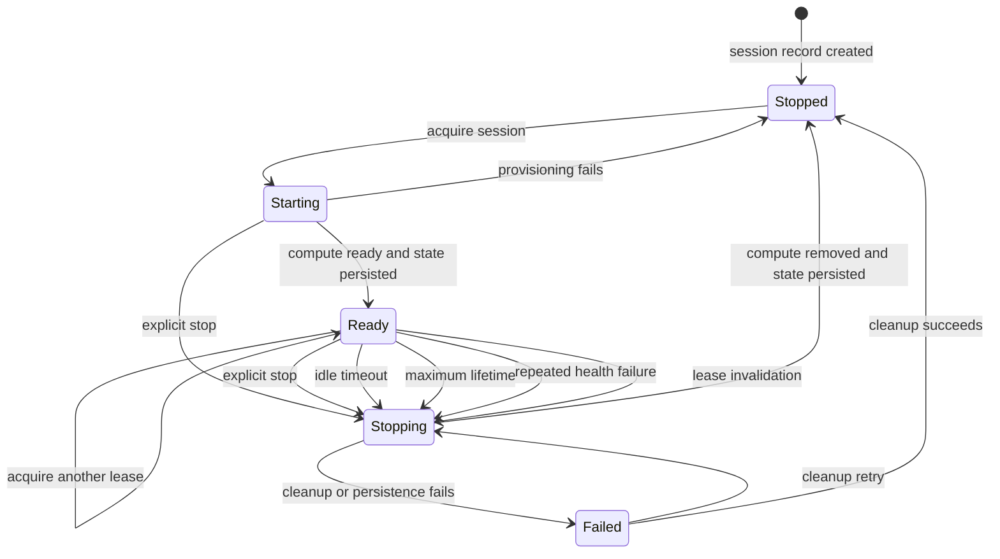
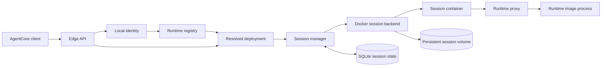
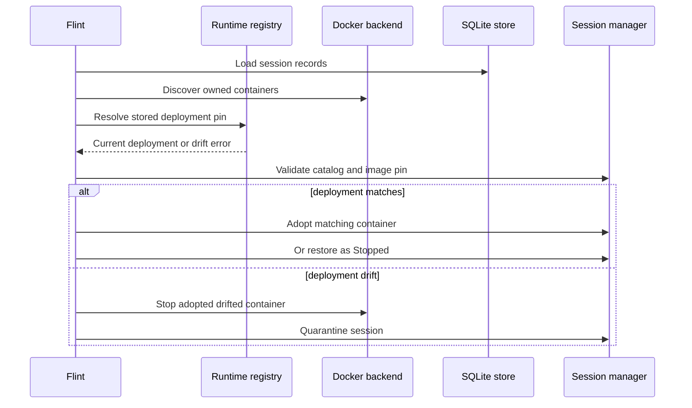
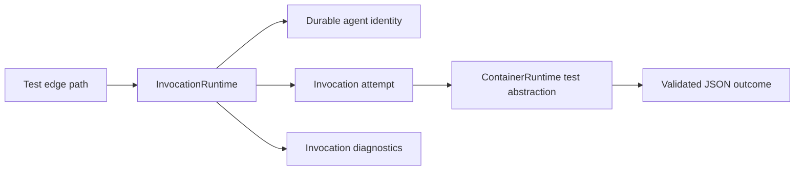

# Flint domain model

This document describes the current model implemented by Flint. It is an
explanation of the code as it exists today, not a target architecture.

The scope decision is recorded in
[ADR-0001](adr/0001-deployed-agentcore-runtime-scope.md): Flint emulates the
deployed AgentCore Runtime service and its local runtime lifecycle, not
AgentCore harness creation or broader resource provisioning.

The canonical vocabulary is in [`CONTEXT.md`](../CONTEXT.md). This document
intentionally includes implementation details and code references; the
glossary does not.

## Scope

Flint is a local development emulator for AWS Bedrock AgentCore Runtime
services. Its primary responsibility is to resolve a runtime request to a
concrete deployment, authorize it, acquire or create session compute, and
forward the operation to a local runtime container.

The current production path is based on persistent logical runtime sessions
and replaceable Docker compute. A separate invocation engine exists under test
configuration and must not be confused with production behavior.

## Core model

### Runtime and deployment

A Runtime is the logical service identified by a runtime ID or ARN. A Runtime
declaration can come from either:

- A JSON catalog
- Docker image discovery using runtime labels:
  - `ai.ameba.flint.runtime.name`
  - `ai.ameba.flint.runtime.protocol`
  - `ai.ameba.flint.runtime.environment-variables` (optional)
  - `ai.ameba.flint.runtime.lifecycle.idle-runtime-session-timeout` (optional)
  - `ai.ameba.flint.runtime.lifecycle.max-lifetime` (optional)

The input declaration is intentionally minimal:

- Runtime name
- Image reference
- Protocol
- Requested environment variable names
- Idle timeout and maximum lifetime

See `src/catalog.rs:416-479`.

The catalog materializes each declaration into a `ResolvedRuntime`. This is
the concrete serving configuration used by request handling and session
management. It contains:

- Runtime ARN, ID, account, and qualifier
- Catalog generation
- Image reference and immutable image identity
- Protocol and fixed protocol paths
- Resolved environment
- Resource, command, lifecycle, connectivity, and proxy policies
- Authentication and authorization configuration

The code commonly calls this value a deployment at the API boundary, while its
Rust type is `ResolvedRuntime`. In this document, deployment means the
concrete resolved runtime snapshot, not a separate persisted entity.

See `src/catalog.rs:174-239`.

A deployment is selected by a qualifier. The internal representation contains
a map of deployments by qualifier, but current resolution accepts only
`DEFAULT`.

See `src/catalog.rs:174-181` and `src/catalog.rs:928-980`.

### Runtime catalog and registry

`RuntimeCatalog` is the in-memory collection of resolved runtime definitions.
It records its source, deterministic generation, and available runtimes.

`RuntimeRegistry` publishes the active catalog snapshot and discovery health.
It supports atomic replacement and runtime resolution. If a later discovery
refresh fails, the existing snapshot remains active and the registry is marked
degraded.

See `src/catalog.rs:24-28` and `src/catalog.rs:71-168`.

The production startup path resolves image references to immutable image
identities even when the initial source is a file catalog. Docker discovery
performs the equivalent resolution while building its discovered catalog.

See `src/docker.rs:825-867` and `src/catalog.rs:759-801`.

### Image discovery

Docker discovery combines image metadata with runtime labels normalized into a
Runtime descriptor. The resulting discovered image includes:

- Image ID
- Platform
- Entrypoint and command
- Image environment
- Working directory
- Image reference
- Runtime descriptor

The catalog generation incorporates source data, discovery policy, descriptor
data, environment values, and immutable image identity. This generation is
later used to detect deployment drift.

See `src/catalog.rs:453-479`, `src/catalog.rs:624-652`, and
`src/catalog.rs:654-757`.

## Identity and access

### Local identity

`LocalIdentity` contains a region and account ID. Unsigned requests use:

```text
region: us-east-1
account: 000000000000
```

Signed requests derive region from the parsed SigV4 credential scope. A
numeric 12-digit access key is interpreted as the account ID. Other access
keys use the local default account.

Runtime resolution rejects a runtime ARN or explicit account ID that conflicts
with the derived identity.

See `src/catalog.rs:31-40`, `src/auth.rs:58-81`, and `src/catalog.rs:928-980`.

### Authentication implementation versus production configuration

The code implements three authentication modes:

- `Permissive`
- `Signature`
- `Policy`

The current production catalog schema does not expose authentication or
authorization fields. File catalogs and Docker discovery currently resolve
deployments with permissive authentication, no configured credentials, and
empty authorization policies.

The Signature and Policy implementations are exercised by test helpers. They
should therefore be documented as implemented capability and test coverage,
not as currently configurable production behavior.

In permissive mode, unsigned requests are accepted. A signed request is
structurally checked for scope, signed headers, and date consistency, but its
HMAC is not cryptographically verified. Full credential lookup, session-token
validation, clock-skew validation, payload hashing, and HMAC verification
occur in the separate Signature and Policy path.

See `src/catalog.rs:416-439`, `src/catalog.rs:643-647`,
`src/catalog.rs:724-731`, `src/catalog.rs:899-906`, and `src/auth.rs:84-192`.

### Authorization policy

When Policy mode is selected, authorization evaluates:

- IAM action
- Resource
- Principal
- Conditions

Identity statements and resource statements are evaluated separately. Explicit
deny wins. An identity allow is always required. If resource statements exist,
a matching resource allow is also required.

A runtime user ID adds `bedrock-agentcore:RuntimeUserId` to the authorization
context. An invocation with a runtime user ID also requires the
`InvokeAgentRuntimeForUser` action.

See `src/auth.rs:194-319`.

There is no persisted user, tenant, or account aggregate. Local identity,
principal, and runtime user ID are request context used during resolution and
authorization.

## Runtime sessions

### Logical session and active compute

A Runtime Session is identified by:

```text
runtime ARN + qualifier + runtime session ID
```

This is represented by `SessionKey`.

The logical session is durable independently of whether active compute exists.
A session can be stopped, become idle, or lose its container and still be
resumed later. The next acquisition provisions or adopts replacement compute
using the same session identity, deployment pin, and persistent volume.

`SessionContainer` represents the current active compute and contains:

- Container ID
- Runtime endpoint
- Container age

The container is replaceable infrastructure, not the logical session identity.

See `src/session.rs:20-45` and `src/session.rs:644-1007`.

### Deployment pinning

A session is pinned to:

- Catalog generation
- Image reference
- Immutable image ID
- Runtime ARN
- Qualifier

At startup, Flint validates persisted records against the current catalog. A
mismatch places the session in a drifted quarantine and prevents that session
from resuming. Other sessions and new runtime resolutions continue using the
current catalog.

See `src/session.rs:467-484`, `src/session.rs:515-538`, and
`src/lib.rs:75-131`.

### Session compute and persistent volume

Production Docker sessions use a deterministic name derived from the runtime
owner and `SessionKey`. The session volume is also derived from that identity
and is mounted at the configured session storage path.

The volume survives container replacement and is not automatically deleted.
The current production persistent volume is not size-bounded by Flint, even
though the resolved resource policy contains a workspace size field.

See `src/docker.rs:1157-1187`, `src/docker.rs:1520-1530`,
`src/docker.rs:1760-1800`, and `README.md:190-206`.

### Session lease

A `SessionLease` represents one operation's hold on active session compute. It
carries:

- The container endpoint
- A cancellation token
- The session key and generation
- The leased container

Acquiring a lease increments `active_requests`. Dropping a lease decrements
activity and updates the last-activity timestamp. A proxy response stream
retains its lease until the stream completes.

Production sessions can have multiple concurrent leases. `active_requests`
prevents unsafe idle reaping; it is not a per-session operation lock.

See `src/session.rs:748-776`, `src/session.rs:1482-1535`, and
`src/proxy.rs:160-239`.

## Session lifecycle

The in-memory lifecycle states are:

- `Starting`: compute provisioning is in progress
- `Ready`: compute is available for leases
- `Stopping`: compute cleanup is in progress
- `Stopped`: the logical session remains, but active compute is absent
- `Failed`: cleanup or persistence failed and may need to be retried

SQLite persists only `Ready` and `Stopped`. `Starting`, `Stopping`, and
`Failed` are transient control-plane states and are not a complete durable
state machine.

See `src/session.rs:320-356` and `src/session_store.rs:15-54`.

### State transitions



The state machine is protected by generation numbers. A stale asynchronous
start or stop completion cannot mutate a newer incarnation of the same session
key.

See `src/session.rs:203-318`, `src/session.rs:644-1007`, and
`src/session.rs:1036-1443`.

### Lifecycle policy

The resolved lifecycle policy contains:

- Startup timeout: fixed internal default of 60 seconds
- Idle timeout: defaults to 900 seconds
- Maximum lifetime: defaults to 28,800 seconds

Idle timeout and maximum lifetime must each be between 60 and 28,800 seconds.
Idle timeout cannot exceed maximum lifetime.

The lifecycle declaration exposes idle timeout and maximum lifetime. Startup
timeout is not currently configurable through the catalog or runtime
descriptor.

See `src/catalog.rs:528-554` and `src/catalog.rs:1217-1219`.

### Health and reaping

The lifecycle reaper evaluates ready sessions periodically.

For HTTP, A2A, and AGUI, health uses the protocol's fixed `/ping` endpoint.
MCP has no health route and uses TCP readiness instead.

Health behavior is:

- `Healthy`: compute may be stopped after idle timeout
- `HealthyBusy`: activity is refreshed and compute is retained
- `Unhealthy`: a consecutive failure counter is incremented

Three consecutive unhealthy checks are required before compute is stopped.
Maximum lifetime remains an independent upper bound.

See `src/catalog.rs:248-291`, `src/docker.rs:1327-1336`, and
`src/session.rs:1251-1443`.

## Production request flow

The production application is assembled in `src/lib.rs:38-180`.



The request path is:

1. Validate request headers and query parameters.
2. Read or generate the runtime session ID.
3. Derive local identity.
4. Resolve a pinned runtime deployment, preferring an existing session's
   pinned deployment.
5. Authorize the operation.
6. Acquire a session lease.
7. Proxy invocation or agent-card traffic, or execute a command through
   Docker exec.
8. Release the lease when the operation completes or is cancelled.

Invocation, command, stop, and agent-card routes are defined in
`src/edge.rs:92-113`.

### Invocation

```text
POST /runtimes/{agent_runtime_arn}/invocations
```

An invocation without a session header receives a generated session ID.
Invocation traffic is forwarded to the protocol-specific runtime path through
`RuntimeProxy`.

The proxy forwards selected content, runtime, MCP, trace, and allowlisted
custom headers. It enforces request, response, chunk, and duration limits.
Transport failure invalidates the lease and causes session cleanup.

See `src/edge.rs:138-309` and `src/proxy.rs:48-239`.

### Command

```text
POST /runtimes/{agent_runtime_arn}/commands
```

Commands require an existing session ID and an enabled command policy. The
command executes inside the active session container using Docker exec. The
result is translated into AWS Event Stream frames containing stdout, stderr,
exit, timeout, cancellation, or exception events.

See `src/edge.rs:321-417`, `src/docker.rs:1338-1510`, and
`src/command.rs:10-91`.

### Stop

```text
POST /runtimes/{agent_runtime_arn}/stopruntimesession
```

Stop cancels active session compute, removes the container, persists the
stopped state, and preserves the logical session and volume. Concurrent stops
with the same client token share cleanup. A different token receives a
retryable conflict while the first stop is active.

See `src/edge.rs:419-493` and `src/session.rs:1036-1249`.

### Agent card

```text
GET /runtimes/{agent_runtime_arn}/invocations/.well-known/agent-card.json
```

Agent-card requests require an existing session ID and a deployment using the
A2A protocol. The request is forwarded through the same session and proxy
model as invocation traffic.

See `src/edge.rs:495-529` and `src/proxy.rs:57-70`.

## Persistence and restart recovery

SQLite stores one record per `(runtime ARN, qualifier, runtime session ID)`.
The record contains:

- Catalog generation
- Image reference and image ID
- Volume name
- Creation and activity timestamps
- Compute start timestamp
- Persisted state
- Last error
- Last stop token

See `src/session_store.rs:35-54` and `src/session_store.rs:286-310`.

Startup reconciliation performs the following:



A matching container is adopted as `Ready`. A persisted session without active
compute is restored as `Stopped`. A session whose deployment pin no longer
matches is quarantined and cannot resume until the state is resolved
externally.

See `src/lib.rs:75-153`.

## Test-only invocation model

The repository also contains a separate invocation model compiled under test
configuration. It should be documented separately from production.



This model includes concepts not used by the production session proxy path:

- `workspace_id`
- Fencing token
- Durable agent identity ID
- Attempt ID
- Retryable container failures
- Attempt timeout and cleanup timeout
- Cost limits
- Output validation requiring a completed JSON object
- One active invocation per durable identity

See `src/runtime.rs:10-139` and `src/runtime.rs:159-314`.

The test edge path uses `InvocationSessionBackend` and an in-memory
active-session map. That path is useful for testing request and failure
behavior, but it is not the production Docker session architecture.

See `src/edge.rs:48-80` and `src/session.rs:120-189`.

## Modeling cautions

The code provides domain-oriented types but does not explicitly define DDD
aggregates, repositories, domain events, or bounded contexts. The following
interpretations are useful but should be labeled as such:

- `ResolvedRuntime` is the concrete deployment snapshot.
- `RuntimeRegistry` behaves like a catalog repository and snapshot
  publisher.
- `SessionManager` is the session lifecycle and concurrency coordinator.
- `SessionKey` is the stable identity of a logical runtime session.
- `SessionEntry` is the in-memory lifecycle representation.

The production model should not claim that:

- The catalog configures production Signature or Policy authentication.
- Every session operation is serialized.
- SQLite contains every transient session state.
- The workspace size policy bounds the persistent Docker volume.
- The `InvocationRuntime` retry and fencing model is used in production.
- `Failed` represents every provisioning failure.
